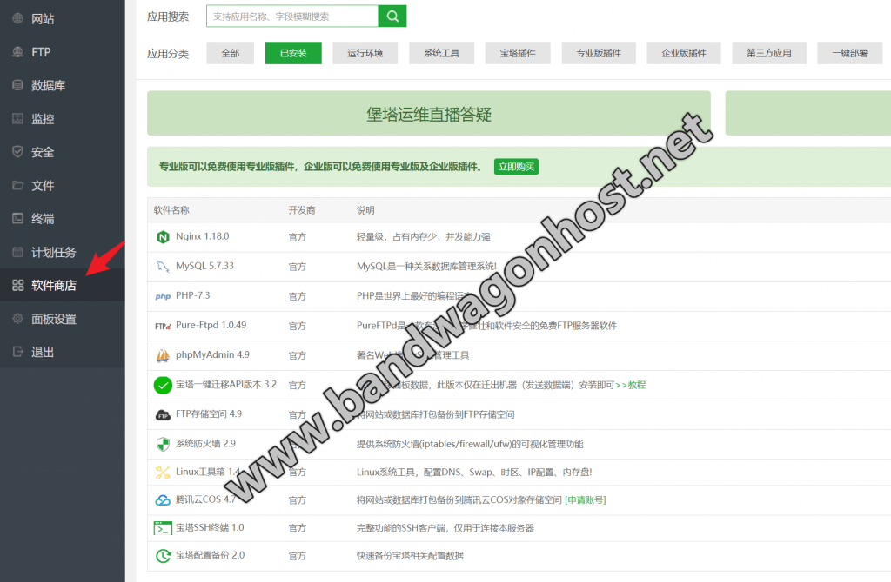
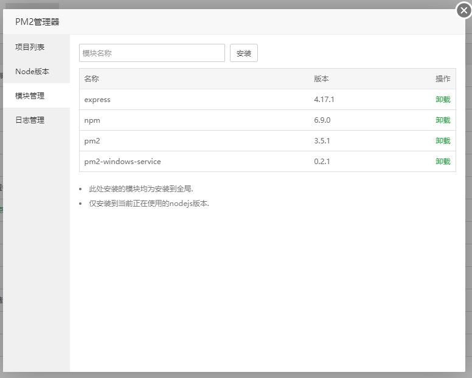
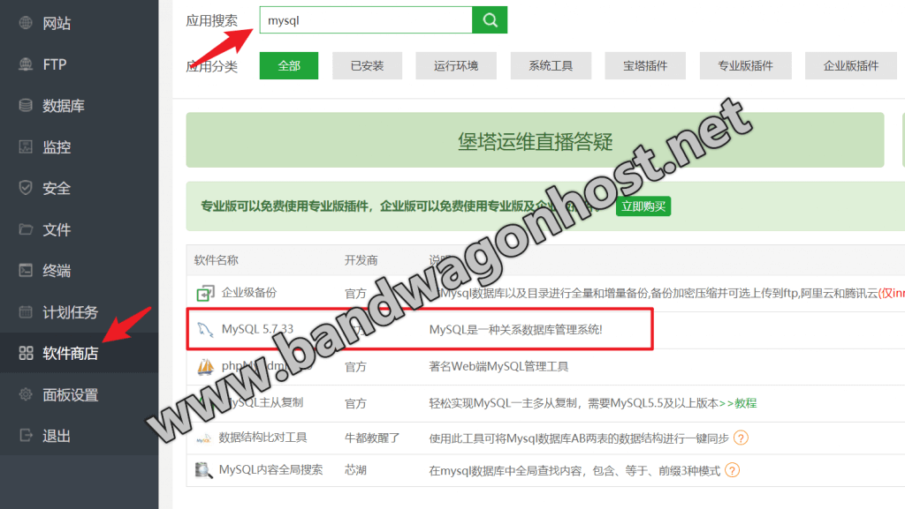
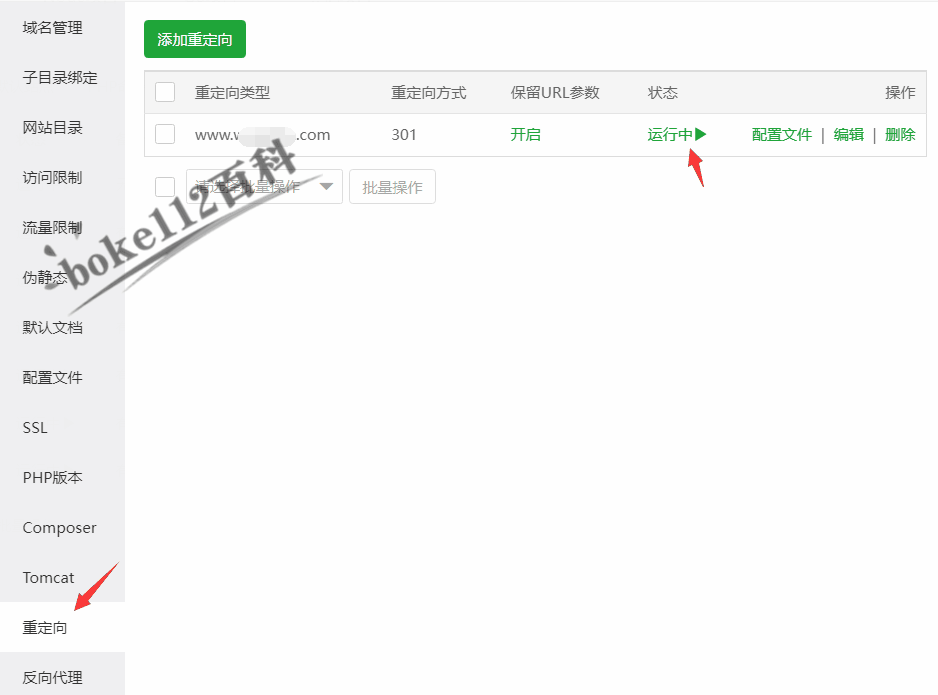
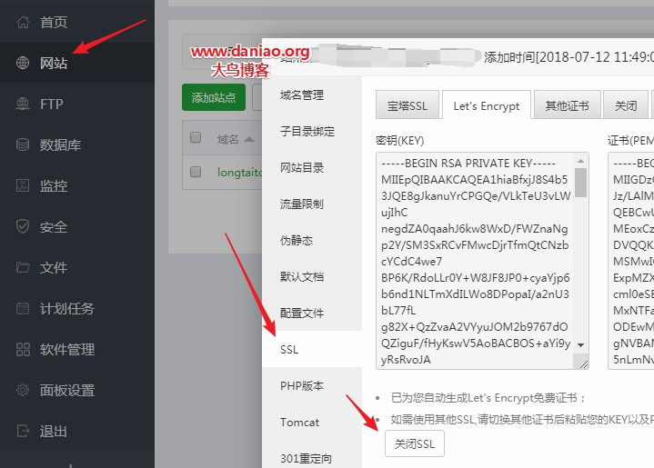

# 闪电帐PRO - 宝塔服务器部署指南（图文版）

> **文档版本**：v1.0  
> **更新日期**：2026年1月11日  
> **作者**：Manus AI  
> **适用项目**：抖店财务应用产品原型（闪电帐PRO）

---

## 目录

1. [部署概述](#1-部署概述)
2. [环境准备](#2-环境准备)
3. [安装必要软件](#3-安装必要软件)
4. [项目上传与配置](#4-项目上传与配置)
5. [Nginx反向代理配置](#5-nginx反向代理配置)
6. [PM2进程管理](#6-pm2进程管理)
7. [SSL证书配置](#7-ssl证书配置)
8. [常见问题排查](#8-常见问题排查)

---

## 1. 部署概述

### 1.1 系统架构

闪电帐PRO是一款面向抖店商家的B端财务管理SaaS应用，采用前后端分离架构。部署时需要配置Nginx作为反向代理，PM2管理Node.js进程，确保应用稳定运行。


**架构说明**：

| 层级 | 组件 | 端口 | 说明 |
|------|------|------|------|
| 接入层 | Nginx | 80/443 | 处理HTTP/HTTPS请求，静态文件服务 |
| 应用层 | Node.js + PM2 | 3000 | 运行前端构建产物和后端API |
| 数据层 | MySQL | 3306 | 存储业务数据 |

### 1.2 部署流程

完整的部署流程包含六个主要步骤，按顺序执行即可完成应用上线。


---

## 2. 环境准备

### 2.1 服务器要求

在开始部署之前，请确保您的服务器满足以下最低配置要求：

| 配置项 | 最低要求 | 推荐配置 |
|--------|----------|----------|
| 操作系统 | CentOS 7.x / Ubuntu 18.04+ | CentOS 7.9 / Ubuntu 20.04 |
| CPU | 1核 | 2核及以上 |
| 内存 | 1GB | 2GB及以上 |
| 硬盘 | 20GB | 40GB及以上 |
| 带宽 | 1Mbps | 5Mbps及以上 |

### 2.2 登录宝塔面板

首先，通过浏览器访问宝塔面板登录地址。默认访问地址为 `http://服务器IP:8888`，输入安装时设置的用户名和密码进行登录。


**登录步骤**：

1. 在浏览器地址栏输入 `http://您的服务器IP:8888`
2. 输入宝塔面板用户名（默认为安装时设置的用户名）
3. 输入对应密码
4. 点击「登录」按钮进入管理后台

> **安全提示**：首次登录后，建议立即修改默认端口和登录密码，增强系统安全性。可在「面板设置」中进行修改。

### 2.3 宝塔面板首页

登录成功后，您将看到宝塔面板的首页仪表盘，显示服务器的实时状态信息。


首页主要展示以下信息：

- **系统信息**：操作系统版本、宝塔版本、运行时间
- **资源监控**：CPU使用率、内存使用率、磁盘使用情况
- **网络流量**：实时上传/下载速度
- **快捷操作**：常用功能入口

---

## 3. 安装必要软件

### 3.1 进入软件商店

点击左侧菜单的「软件商店」，进入软件安装页面。宝塔面板提供了丰富的一键安装软件，大大简化了环境配置工作。



### 3.2 安装Nginx

在软件商店中搜索「Nginx」，选择稳定版本进行安装。

**安装步骤**：

1. 在软件商店搜索框输入「Nginx」
2. 找到 Nginx 1.24 或更高版本
3. 点击「安装」按钮
4. 在弹出的确认框中选择「极速安装」
5. 等待安装完成（约2-5分钟）

| 软件 | 推荐版本 | 安装方式 | 预计时间 |
|------|----------|----------|----------|
| Nginx | 1.24+ | 极速安装 | 2-5分钟 |
| MySQL | 5.7 / 8.0 | 极速安装 | 5-10分钟 |
| Node.js | 18.x LTS | 极速安装 | 2-3分钟 |
| PM2管理器 | 最新版 | 极速安装 | 1-2分钟 |

### 3.3 安装Node.js

Node.js是运行闪电帐PRO的核心环境。在软件商店中搜索「Node.js版本管理器」或「PM2管理器」进行安装。

**安装步骤**：

1. 在软件商店搜索「PM2管理器」
2. 点击安装，系统会自动安装Node.js环境
3. 安装完成后，点击「设置」进入PM2管理界面
4. 在「Node版本」处选择安装 Node.js 18.x LTS 版本



### 3.4 安装MySQL数据库

如果您的应用需要数据库支持，需要安装MySQL。

**安装步骤**：

1. 在软件商店搜索「MySQL」
2. 选择 MySQL 5.7 或 MySQL 8.0 版本
3. 点击「安装」并选择「极速安装」
4. 等待安装完成



---

## 4. 项目上传与配置

### 4.1 创建网站

在宝塔面板中创建一个新网站，用于托管闪电帐PRO应用。


**创建步骤**：

1. 点击左侧菜单「网站」
2. 点击「添加站点」按钮
3. 填写网站信息：
   - **域名**：填写您的域名（如 `finance.example.com`）
   - **根目录**：设置为 `/www/wwwroot/doudian-finance`
   - **FTP**：不创建
   - **数据库**：选择 MySQL（如需要）
   - **PHP版本**：选择「纯静态」
4. 点击「提交」完成创建

### 4.2 上传项目文件

将本地构建好的项目文件上传到服务器。

**方法一：通过宝塔文件管理器**

1. 点击左侧菜单「文件」
2. 导航到 `/www/wwwroot/doudian-finance` 目录
3. 点击「上传」按钮
4. 选择本地打包好的项目文件（dist.zip）
5. 上传完成后，右键点击压缩包选择「解压」

**方法二：通过SSH命令行**

```bash
# 进入项目目录
cd /www/wwwroot/doudian-finance

# 使用scp上传文件（在本地执行）
scp -r ./dist/* root@服务器IP:/www/wwwroot/doudian-finance/

# 或使用git克隆项目
git clone https://github.com/your-repo/doudian-finance.git .
```

### 4.3 安装项目依赖

进入项目目录，安装Node.js依赖包。

```bash
# 进入项目目录
cd /www/wwwroot/doudian-finance

# 安装依赖
npm install --production

# 或使用pnpm
pnpm install --prod
```

### 4.4 配置环境变量

创建 `.env` 文件配置环境变量。

```bash
# 创建环境变量文件
cat > /www/wwwroot/doudian-finance/.env << EOF
# 应用配置
NODE_ENV=production
PORT=3000

# 数据库配置
DB_HOST=localhost
DB_PORT=3306
DB_USER=doudian_user
DB_PASSWORD=your_password
DB_NAME=doudian_finance

# 其他配置
JWT_SECRET=your_jwt_secret_key
EOF
```

---

## 5. Nginx反向代理配置

### 5.1 配置反向代理

Nginx反向代理将外部请求转发到Node.js应用，同时处理静态文件服务和SSL终端。


**配置步骤**：

1. 在「网站」列表中找到刚创建的站点
2. 点击站点名称进入设置
3. 选择左侧「反向代理」选项卡
4. 点击「添加反向代理」


**代理配置参数**：

| 配置项 | 值 | 说明 |
|--------|-----|------|
| 代理名称 | doudian-api | 自定义名称 |
| 目标URL | http://127.0.0.1:3000 | Node.js应用地址 |
| 发送域名 | $host | 保持原始域名 |

### 5.2 完整Nginx配置示例

如需手动编辑Nginx配置，可参考以下完整配置：

```nginx
server {
    listen 80;
    listen 443 ssl http2;
    server_name finance.example.com;
    
    # SSL证书配置（配置SSL后自动生成）
    ssl_certificate    /www/server/panel/vhost/cert/finance.example.com/fullchain.pem;
    ssl_certificate_key    /www/server/panel/vhost/cert/finance.example.com/privkey.pem;
    ssl_protocols TLSv1.2 TLSv1.3;
    ssl_ciphers ECDHE-RSA-AES128-GCM-SHA256:HIGH:!aNULL:!MD5:!RC4:!DHE;
    ssl_prefer_server_ciphers on;
    
    # 强制HTTPS
    if ($server_port !~ 443){
        rewrite ^(/.*)$ https://$host$1 permanent;
    }
    
    # 网站根目录
    root /www/wwwroot/doudian-finance/dist;
    index index.html;
    
    # 静态文件缓存
    location ~* \.(js|css|png|jpg|jpeg|gif|ico|svg|woff|woff2)$ {
        expires 30d;
        add_header Cache-Control "public, immutable";
    }
    
    # API反向代理
    location /api {
        proxy_pass http://127.0.0.1:3000;
        proxy_set_header Host $host;
        proxy_set_header X-Real-IP $remote_addr;
        proxy_set_header X-Forwarded-For $proxy_add_x_forwarded_for;
        proxy_set_header X-Forwarded-Proto $scheme;
        proxy_connect_timeout 60s;
        proxy_read_timeout 60s;
    }
    
    # SPA路由支持
    location / {
        try_files $uri $uri/ /index.html;
    }
    
    # 禁止访问敏感文件
    location ~ /\. {
        deny all;
    }
    
    # 访问日志
    access_log /www/wwwlogs/finance.example.com.log;
    error_log /www/wwwlogs/finance.example.com.error.log;
}
```

---

## 6. PM2进程管理

### 6.1 使用PM2管理器

宝塔面板的PM2管理器提供了可视化的Node.js进程管理界面。

**添加项目步骤**：

1. 点击左侧菜单「软件商店」
2. 找到已安装的「PM2管理器」，点击「设置」
3. 在「项目列表」中点击「添加项目」
4. 填写项目信息：
   - **项目名称**：doudian-finance
   - **启动文件**：/www/wwwroot/doudian-finance/dist/index.js
   - **运行目录**：/www/wwwroot/doudian-finance
5. 点击「确定」启动项目

### 6.2 PM2命令行操作

也可以通过SSH命令行管理PM2进程：

```bash
# 启动应用
pm2 start /www/wwwroot/doudian-finance/dist/index.js --name doudian-finance

# 查看运行状态
pm2 status

# 查看日志
pm2 logs doudian-finance

# 重启应用
pm2 restart doudian-finance

# 停止应用
pm2 stop doudian-finance

# 设置开机自启
pm2 save
pm2 startup
```

### 6.3 PM2配置文件

创建 `ecosystem.config.js` 配置文件，实现更精细的进程管理：

```javascript
// ecosystem.config.js
module.exports = {
  apps: [{
    name: 'doudian-finance',
    script: './dist/index.js',
    cwd: '/www/wwwroot/doudian-finance',
    instances: 'max',  // 根据CPU核心数自动扩展
    exec_mode: 'cluster',
    env: {
      NODE_ENV: 'production',
      PORT: 3000
    },
    error_file: '/www/wwwlogs/doudian-finance-error.log',
    out_file: '/www/wwwlogs/doudian-finance-out.log',
    log_date_format: 'YYYY-MM-DD HH:mm:ss',
    max_memory_restart: '500M',
    restart_delay: 3000,
    autorestart: true,
    watch: false
  }]
};
```

使用配置文件启动：

```bash
pm2 start ecosystem.config.js
```

---

## 7. SSL证书配置

### 7.1 申请Let's Encrypt免费证书

宝塔面板支持一键申请Let's Encrypt免费SSL证书，有效期90天，支持自动续期。



**申请步骤**：

1. 在「网站」列表中点击站点名称
2. 选择左侧「SSL」选项卡
3. 选择「Let's Encrypt」
4. 勾选需要申请证书的域名
5. 点击「申请」按钮



### 7.2 证书申请注意事项

| 注意事项 | 说明 |
|----------|------|
| 域名解析 | 确保域名已正确解析到服务器IP |
| 端口开放 | 确保80和443端口已开放 |
| 防火墙 | 检查服务器防火墙和安全组设置 |
| 验证方式 | 推荐使用「文件验证」方式 |

### 7.3 强制HTTPS

证书申请成功后，建议开启强制HTTPS跳转：

1. 在SSL设置页面找到「强制HTTPS」选项
2. 点击开关启用强制跳转
3. 所有HTTP请求将自动重定向到HTTPS

---

## 8. 常见问题排查

### 8.1 应用无法访问

**问题现象**：浏览器访问域名显示无法连接或502错误。

**排查步骤**：

```bash
# 1. 检查Node.js应用是否运行
pm2 status

# 2. 检查应用日志
pm2 logs doudian-finance --lines 50

# 3. 检查端口占用
netstat -tlnp | grep 3000

# 4. 检查Nginx状态
systemctl status nginx

# 5. 检查Nginx错误日志
tail -f /www/wwwlogs/finance.example.com.error.log
```

### 8.2 数据库连接失败

**问题现象**：应用启动后提示数据库连接错误。

**解决方案**：

1. 检查数据库服务是否运行
2. 验证数据库用户名和密码
3. 确认数据库用户权限
4. 检查 `.env` 文件中的数据库配置

```bash
# 测试数据库连接
mysql -u doudian_user -p -h localhost doudian_finance
```

### 8.3 静态资源404

**问题现象**：页面加载但CSS/JS文件显示404。

**解决方案**：

1. 检查Nginx配置中的root路径是否正确
2. 确认dist目录下文件是否完整
3. 检查文件权限

```bash
# 检查文件权限
ls -la /www/wwwroot/doudian-finance/dist/

# 修复权限
chown -R www:www /www/wwwroot/doudian-finance/
chmod -R 755 /www/wwwroot/doudian-finance/
```

### 8.4 SSL证书申请失败

**问题现象**：Let's Encrypt证书申请失败。

**常见原因及解决方案**：

| 原因 | 解决方案 |
|------|----------|
| 域名未解析 | 确保域名A记录指向服务器IP |
| 端口被封 | 检查云服务商安全组，开放80/443端口 |
| 防火墙拦截 | 临时关闭防火墙测试 |
| 申请次数限制 | 等待1小时后重试 |

---

## 附录

### A. 快速部署命令汇总

```bash
# 1. 进入项目目录
cd /www/wwwroot/doudian-finance

# 2. 安装依赖
npm install --production

# 3. 构建项目（如果需要）
npm run build

# 4. 启动PM2
pm2 start ecosystem.config.js

# 5. 保存PM2配置
pm2 save

# 6. 设置开机自启
pm2 startup
```

### B. 目录结构说明

```
/www/wwwroot/doudian-finance/
├── dist/                    # 构建输出目录
│   ├── index.html          # 入口HTML
│   ├── assets/             # 静态资源
│   └── index.js            # 服务端入口
├── node_modules/           # 依赖包
├── .env                    # 环境变量
├── package.json            # 项目配置
└── ecosystem.config.js     # PM2配置
```

### C. 联系与支持

如在部署过程中遇到问题，可通过以下方式获取帮助：

- **宝塔官方文档**：https://www.bt.cn/bbs/
- **Node.js官方文档**：https://nodejs.org/docs/
- **PM2官方文档**：https://pm2.keymetrics.io/docs/

---

> **文档声明**：本文档由Manus AI自动生成，仅供参考。实际部署时请根据您的服务器环境和项目需求进行调整。
